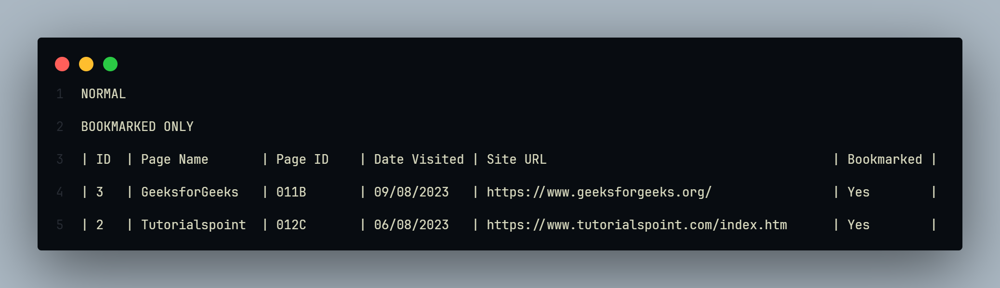

    

  

    
    
Milestone 1 of Data Structures and Algorithms involves creating a Browser History Manager, an application designed to manage the browsing history of a user. The application should allow the insertion, deletion, display of history, display of history in reverse order, and display of bookmarked sites. To achieve this a Linear Doubly Linked List is utilized along with it corresponding methods.

    
    
    

        
    

    
    

        
    

    
    

        
    

    
    

        
    

    
    

        
    

    
    <ul>
        <li>Programming Language: C</li>
        <li>Build System: CMake</li>
        <li>Version Control: Git</li>
        <li>Programming Paradigm(s): Procedural, Object-Oriented</li>
    </ul>

    

    
    <ul>
        <li>None</li>
    </ul>
    
    <ol>
        <li>Clone the repository to your local computer.</li>
        <li>Navigate to "BrowserHistoryManager.exe" on the "cmake-build-debug" and run it.</li>
    </ol>

    
    
Thank you for checking my project out! In case of any feedback on the project please contact me.

